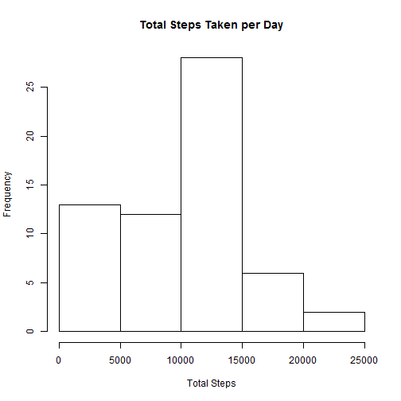

Reproducible Research: Peer Assessment 1
========================================

**Author:** Nikki Sutherland  
**Date:** January 17, 2015

## Introduction

This assignment takes activity data from a personal activity monitoring device 
and performs some basic analysis on the steps taken per 5-minute interval for 
a 2-month period.

The variables included in this dataset are:

* **steps**: Number of steps taking in a 5-minute interval (missing values are
    coded as `NA`)

* **date**: The date on which the measurement was taken in YYYY-MM-DD format

* **interval**: Identifier for the 5-minute interval in which
    measurement was taken
    
The interval is essentially the given time of day. For example, 955 is 9:55 AM
and 1810 corresponds to 6:10 PM.

### Loading and Preprocessing the Data
  
Load the packages to be used for analysis:


```r
library(plyr)
library(knitr)
```

  
Create a "data" directory and then load the data:


```r
if (!file.exists("./data")) { dir.create("./data") }
activity_file <- "activity.zip"
unzip(activity_file, overwrite = TRUE, list = FALSE, junkpaths = TRUE, 
      exdir = "./data", unzip = "internal", setTimes = FALSE)
activity_data <- read.csv("./data/activity.csv", colClasses = c("numeric", "character", "numeric"))
```


The activity data looks like this:


```r
head(activity_data)
```

```
##   steps       date interval
## 1    NA 2012-10-01        0
## 2    NA 2012-10-01        5
## 3    NA 2012-10-01       10
## 4    NA 2012-10-01       15
## 5    NA 2012-10-01       20
## 6    NA 2012-10-01       25
```

```r
tail(activity_data)
```

```
##       steps       date interval
## 17563    NA 2012-11-30     2330
## 17564    NA 2012-11-30     2335
## 17565    NA 2012-11-30     2340
## 17566    NA 2012-11-30     2345
## 17567    NA 2012-11-30     2350
## 17568    NA 2012-11-30     2355
```

```r
summary(activity_data)
```

```
##      steps            date              interval     
##  Min.   :  0.00   Length:17568       Min.   :   0.0  
##  1st Qu.:  0.00   Class :character   1st Qu.: 588.8  
##  Median :  0.00   Mode  :character   Median :1177.5  
##  Mean   : 37.38                      Mean   :1177.5  
##  3rd Qu.: 12.00                      3rd Qu.:1766.2  
##  Max.   :806.00                      Max.   :2355.0  
##  NA's   :2304
```


### Mean Total Number of Steps Taken per Day

Use ddply to get the total steps for each day:

```r
total_steps <- ddply(activity_data, .(date), summarize, Total_steps=sum(steps, na.rm = TRUE))
head(total_steps)
```

```
##         date Total_steps
## 1 2012-10-01           0
## 2 2012-10-02         126
## 3 2012-10-03       11352
## 4 2012-10-04       12116
## 5 2012-10-05       13294
## 6 2012-10-06       15420
```

```r
tail(total_steps)
```

```
##          date Total_steps
## 56 2012-11-25       11834
## 57 2012-11-26       11162
## 58 2012-11-27       13646
## 59 2012-11-28       10183
## 60 2012-11-29        7047
## 61 2012-11-30           0
```

```r
summary(total_steps)
```

```
##      date            Total_steps   
##  Length:61          Min.   :    0  
##  Class :character   1st Qu.: 6778  
##  Mode  :character   Median :10395  
##                     Mean   : 9354  
##                     3rd Qu.:12811  
##                     Max.   :21194
```

Create a histogram of the total number of steps taken each day:


```r
hist(total_steps$Total_steps, main = "Total Steps Taken per Day", xlab = "Total Steps")
```

 

Then take the mean and median total number of steps taken per day:

```r
mean(total_steps$Total_steps)
```

```
## [1] 9354.23
```

```r
median(total_steps$Total_steps)
```

```
## [1] 10395
```


### Average Daily Activity Pattern

Use ddply to calculate the average number of steps taken at each interval:

```r
average_steps_interval <- ddply(activity_data, .(interval), summarize, Average_steps=mean(steps, na.rm = TRUE))
```

Create a time series plot of the 5-minute interval and the average number of 
steps taken, averaged across all days:

```r
plot(average_steps_interval$interval, average_steps_interval$Average_steps, 
     type = "l", main = "Average Steps Taken per 5-minute Interval",
     xlab = "Interval", ylab = "Average Steps Taken")
```

 

Determine which 5-minute interval, on average across all the days in the 
dataset,contains the maximum number of steps:

```r
max_steps <- which.max(as.double(average_steps_interval$Average_steps))
average_steps_interval[max_steps, "interval"]
```

```
## [1] 835
```

So, on average, 8:35 AM has the most steps taken.

### Inputing Missing Values

Calculate and report the total number of missing values in the dataset:


```r
nas <- activity_data[is.na(activity_data$steps),]
number_nas <- nrow(nas)
number_nas
```

```
## [1] 2304
```

There are 2,304 observations for steps that have NA values.  

Using the average step value for the missing intervals, create a new dataset
that is equal to the original dataset but with the missing data filled in:


### Comparing Weekday and Weekend Activity Patterns


